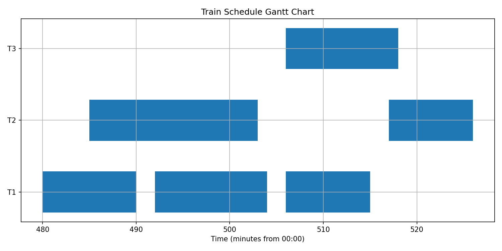

# 🚆 Smart Train Scheduling Simulator  

An AI-driven train scheduling system built with **Python, Graph Algorithms, and Streamlit** to optimize train timetables across multiple stations.  
This project demonstrates how data science, optimization, and visualization can be applied to **digital mobility and smart signalling systems**.  

---

## ✨ Features  
- ⚡ **Optimized Scheduling** using graph algorithms to minimize delays & improve passenger flow.  
- 📊 **Interactive Gantt Charts** to visualize train timetables.  
- 🖥 **Streamlit Web App** – run it locally or live in your browser.  
- 📂 Works with custom datasets (`stations.csv`, `edges.csv`, `trains.csv`).  
- ⬇️ **Export Results** as CSV for further analysis.  

---

## 📸 Screenshots  

### Streamlit App  
  

---

## 🏗 Project Structure  
```
smart-train-scheduler/
│── data/              # Example input datasets
│── outputs/           # Generated schedules + charts
│── src/               # Source code
│   ├── scheduler.py   # Core scheduling algorithm
│   ├── visualize.py   # Gantt chart visualization
│   ├── demo.py        # Run scheduling from CLI
│   ├── app.py         # Streamlit Web UI
│── requirements.txt   # Python dependencies
│── README.md
```

---

## ⚙️ Installation & Usage  

### 1. Clone Repo  
```bash
git clone https://github.com/<your-username>/smart-train-scheduler.git
cd smart-train-scheduler
```

### 2. Install Dependencies  
```bash
pip install -r requirements.txt
```

### 3. Run Scheduler (CLI)  
```bash
python src/demo.py
```
Output is saved in `outputs/`.

### 4. Run Web App (Streamlit)  
```bash
streamlit run src/app.py
```
Open 👉 [http://localhost:8501](http://localhost:8501)  

---

## 📊 Example Output  

**Timetable CSV**
| train_id | station | arrival_time | departure_time |
|----------|---------|--------------|----------------|
| T1       | A       | 0            | 2              |
| T1       | B       | 7            | 9              |

**Gantt Chart**


---

## 🛠 Tech Stack  
- **Python 3.10+**  
- **NetworkX** (graph algorithms)  
- **Matplotlib** (visualizations)  
- **Pandas** (data handling)  
- **Streamlit** (UI)  

---

## 📜 License  
MIT License – feel free to use & improve.  
